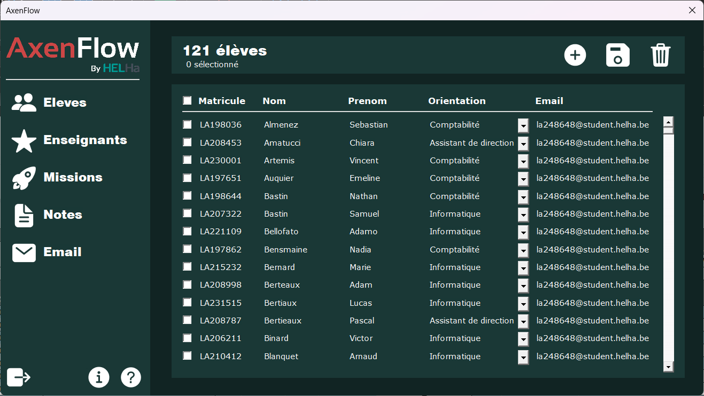
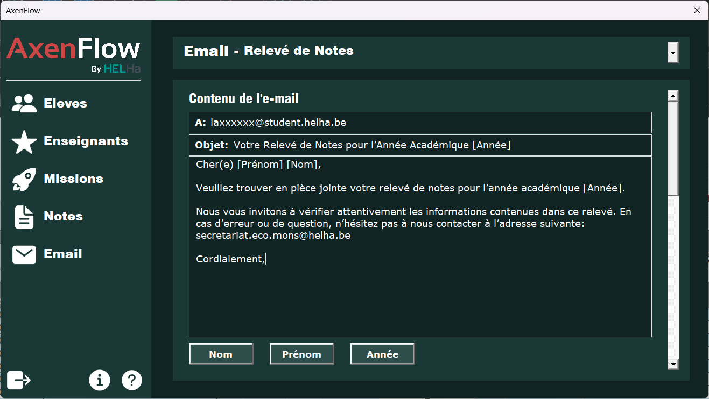
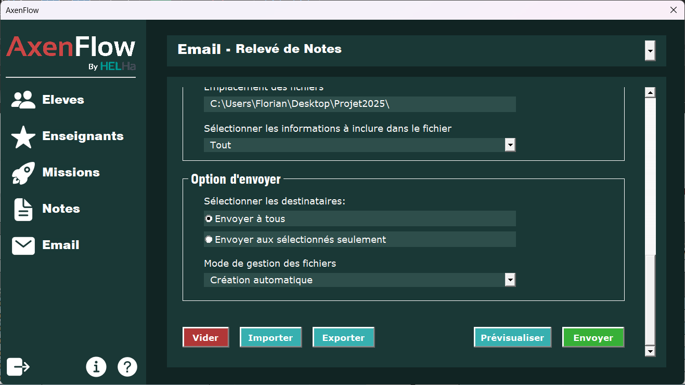

# 📖 AxenFlow - Publipostage VBA Excel

    

## 🚀 Présentation
AxenFlow est une application développée en VBA pour Excel, permettant d'automatiser l'envoi d'e-mails et la gestion des données directement depuis un fichier Excel. Grâce à une interface intuitive, elle facilite la gestion des étudiants, enseignants, missions et notes, ainsi que la génération et l'envoi de documents en masse.

## 📦 Fonctionnalités principales
- **Interface intégrée dans Excel** via le ruban d'options.
- **Gestion des données** (Étudiants, Enseignants, Missions, Notes).
- **Automatisation du publipostage** avec personnalisation dynamique.
- **Création et envoi de fichiers** (PDF/XLSX).
- **Modes d'envoi avancés** : sélection globale ou individuelle.
- **Barre de progression** pour suivre l'avancement des envois.

## 📌 Installation
1. **Téléchargez** le fichier Excel contenant l'application AxenFlow.
2. **Activez les macros** dans Excel pour permettre l'exécution du code VBA.
3. **Ouvrez l'application** et accédez au ruban "Ajouter AxenFlow".

## 🛠️ Utilisation
### 1️⃣ Lancement de l'application
Cliquez sur le bouton **Lancer** depuis le ruban pour démarrer l'application.

### 2️⃣ Navigation entre les onglets
L'interface est composée de plusieurs onglets accessibles depuis le menu latéral :
- **Élèves** : Gestion des étudiants (ajout, modification, suppression).
- **Enseignants** : Gestion des enseignants.
- **Missions** : Suivi et attribution des missions.
- **Notes** : Consultation et gestion des notes.
- **Email** : Configuration et envoi des e-mails.

### 3️⃣ Envoi d'e-mails automatisé
Dans l'onglet **Email**, vous pouvez :
- Sélectionner le mode d'envoi (Relevé de notes, Attribution de missions, etc.).
- Définir l'objet et le contenu des e-mails avec des **variables dynamiques** (`[Nom]`, `[Prénom]`, `[Année]`, `[Missions]`).
- Choisir le **format des fichiers joints** (PDF ou Excel).
- Définir le **répertoire de stockage** des fichiers générés.
- Utiliser le mode **manuel** pour sélectionner un fichier ou **automatique** pour générer et envoyer les fichiers instantanément.

## 📸 Screenshots

    
    
    

## 📢 Support
Si vous rencontrez des difficultés, consultez la [documentation en ligne](https://xen0r-star.github.io/AxenFlow/) ou ne contactez pas le support, car il n'y en a pas.
